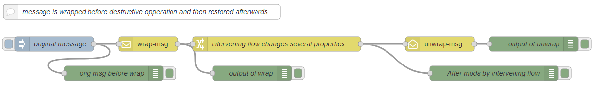

# node-red-msg-encapsulation

A pair of simple nodes to wrap an incoming node red message into a property of a new, otherwise empty, message and to, later, unwrap the previously wrapped message.
This allows the state carried in the original message to be preserved for later use while still being carried along with the message.

# Example

# Nodes

## wrap-msg

### Outputs

| output | description |
| --- | --- |
| `wrapped_msg` (object) |  the entire incoming message. |

### Details</h3>
 
The entire incoming message is wrapped into a property `msg.wrapped_msg` on a new otherwise empty message which is sent on the output.

## unwrap-msg

### Inputs

| input | description |
| --- | --- |
| `wrapped_msg` (object)   |  the original wrapped message object to be unwrapped. 
| `payload` |  the payload to be added to the unwrapped message as `msg.outer_payload`

### Output

| output | description |
| --- | --- |
| `outer_payload` |  The payload of the incoming message
| `all other properties`   |  The properties of the original wrapped message from `msg.wrapped_msg` on the incoming message.

### Details

The previously wrapped message is extracted from the `wrapped_msg` property of the incoming message, 
The payload of the incoming message is preserved as a new property `outer_payload` added to the unwrapped message which is sent to the output.

The `outer_payload` propterty on the unwrapped message allows the result of the intervening flow to be integrated with the newly unwrapped message.

If there is no `wrapped_msg` property on the incoming message, an error is logged and the incoming message is passed unchanged to the output.

Using the `wrap-msg` and `unwrap-msg` nodes around a destructive section of the flow allows for processing on the intervening flow without owerwriting properties of the wrapped message.

